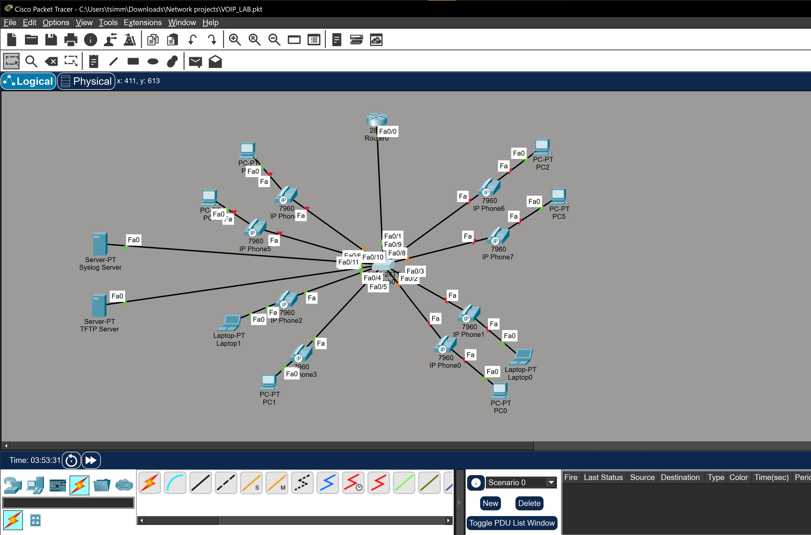
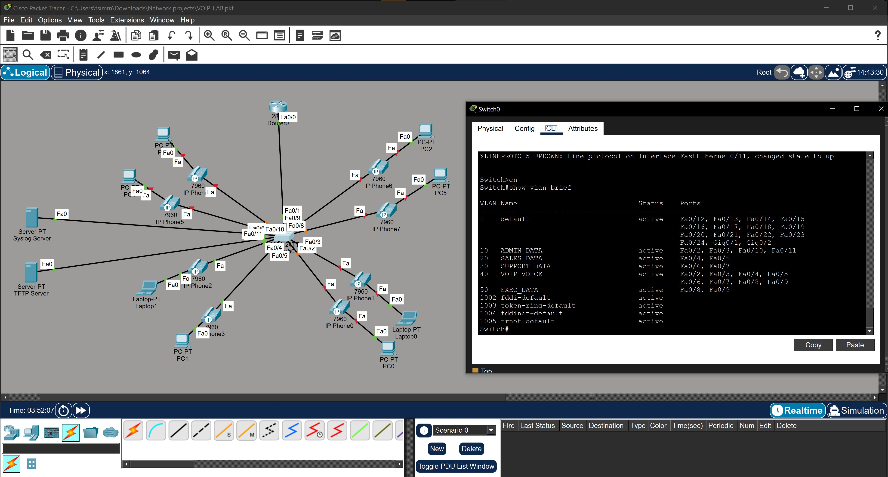

# Enterprise Cisco VoIP & Telephony Infrastructure Deployment

## Executive Summary
This project demonstrates the design, configuration, and verification of an enterprise-grade Voice over IP (VoIP) network deployed on Cisco routing and switching hardware within Cisco Packet Tracer. The infrastructure integrates **Cisco Unified Communications Manager Express (CME)** telephony services, dual-VLAN access architecture (Voice + Data segmentation), DHCP Option 150 provisioning, TFTP firmware delivery, and centralized Syslog telemetry.

---

## Architecture & Topology Overview

The network topology implements an access-layer distribution model connecting desktop PCs daisy-chained through **Cisco 7960 IP Phones** to a centralized Cisco Catalyst switch, routed via a Cisco 2811 Integrated Services Router (ISR).



### Core Infrastructure Components
* **Voice Gateway / Call Processing Router:** Cisco 2811 ISR running Cisco IOS Telephony Service (CME).
* **Access Switch:** Cisco Catalyst 2960 / 3560 with 802.1Q trunking and auxiliary Voice VLAN tagging.
* **Telephony Endpoints:** Cisco 7960 IP Phones with inline PC bridge ports.
* **Network Services:** Centralized TFTP Server (firmware/XML configs) and Syslog Server (telephony event logging).

---

## Technical Implementation Details

### 1. VLAN Segmentation & Switchport Voice Configuration
To prevent voice traffic degradation from standard workstation data bursts, access ports were configured with separate Data and Voice VLANs (e.g., VLAN 40 for VoIP) using Cisco auxiliary VLAN tagging. 



```text
interface FastEthernet0/1
 switchport mode access
 switchport access vlan 10
 switchport voice vlan 40
```

2. Network Services: TFTP & Syslog Integration
The environment utilizes centralized servers for network management. The TFTP Server provisions router configurations and IP phone firmware files, while the Syslog Server captures real-time administrative and telemetry events from the networking hardware.

3. Multi-Scope DHCP & Option 150 Provisioning
The router was configured as the centralized DHCP server. The voice scope utilizes Option 150 to instruct registered IP phones where to download their operational configuration and firmware files:

! Voice DHCP Pool with Option 150
ip dhcp pool VOIP_VOICE
network 192.168.40.0 255.255.255.0
default-router 192.168.40.1
option 150 ip 192.168.40.1
The router hosts the local PBX/call processing engine via Cisco IOS telephony-service, dynamically allocating Directory Numbers (DNs)

telephony-service
 max-ephones 10
 max-dn 10
 ip source-address 192.168.40.1 port 2000
 auto assign 1 to 10

 Call Routing & Dial Verification
End-to-end call processing was validated across endpoints by executing test calls between active extensions:

Source Endpoint: IP Phone 3 (Ext 1003)

Destination Endpoint: IP Phone 2 (Ext 1002)

State: Verified active two-way call state (Ring Out / From: 1003 Connected).

Key Enterprise Networking Competencies
Cisco IOS Voice Configuration: Configuring telephony-service, ephone, and ephone-dn parameters on Cisco ISR hardware.

VLAN & QoS Segmentation: Segregating latency-sensitive voice traffic from workstation data traffic using switchport voice vlan.

Dynamic Endpoint Provisioning: Deploying Option 150 within DHCP scopes for automated IP phone registration and provisioning.

Inter-VLAN Routing: Configuring router-on-a-stick sub-interfaces (802.1Q encapsulation) to handle multi-subnet traffic boundaries.

Network Telemetry Integration: Routing telephony events and switch states to central TFTP and Syslog management servers.
